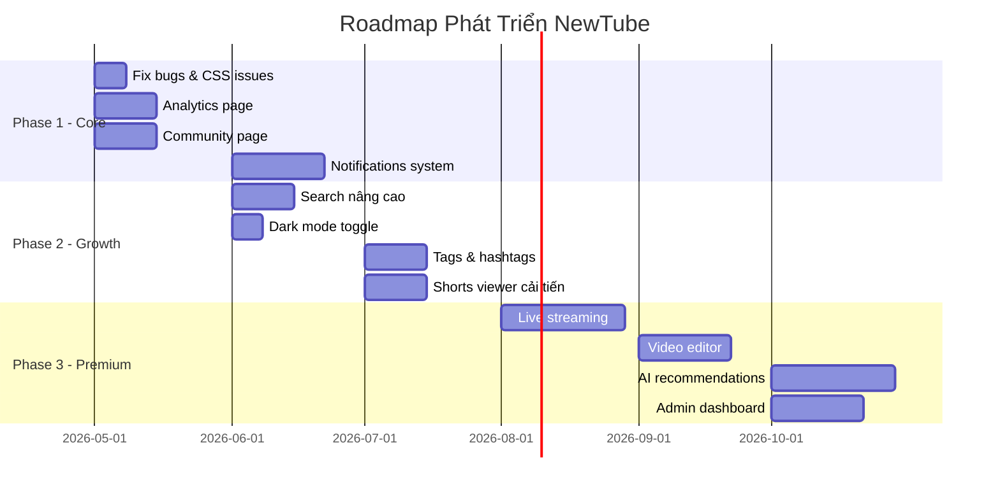

# 📋 Nhận Xét & Ý Tưởng Phát Triển — Dự Án NewTube

> **Dự án:** NewTube (YouTube Clone)  
> **Ngày đánh giá:** 06/05/2026  
> **Phiên bản:** 0.1.0

---

## 📊 Tổng Quan Dự Án

### Tech Stack

| Layer | Công nghệ |
|-------|-----------|
| **Framework** | Next.js 15 (App Router) |
| **Language** | TypeScript |
| **Database** | Neon (PostgreSQL Serverless) |
| **ORM** | Drizzle ORM |
| **Auth** | Clerk |
| **API** | tRPC v11 (React Query) |
| **Video** | Mux (streaming, HLS, subtitles) |
| **File Upload** | UploadThing |
| **Rate Limiting** | Upstash Redis + Ratelimit |
| **Background Jobs** | Upstash Workflow |
| **AI Features** | Workflow-based (title, description, thumbnail generation) |
| **Styling** | Tailwind CSS + Radix UI (shadcn/ui) |
| **Media** | Cloudinary (images), FFmpeg (video processing) |

### Cấu Trúc Module

```
src/modules/
├── auth/              # Xác thực
├── categories/        # Danh mục video
├── comments/          # Hệ thống bình luận (reply, pin, heart, reaction)
├── comment-reactions/  # Like/dislike bình luận
├── home/              # Trang chủ (layouts, sections, views)
├── playlists/         # Playlist thường + Mix playlist
├── search/            # Tìm kiếm
├── studio/            # Creator Studio (dashboard, video manager)
├── subscriptions/     # Đăng ký kênh
├── suggestions/       # Đề xuất video
├── users/             # Hồ sơ người dùng (banner, bio, avatar)
├── video-reactions/   # Like/dislike video
├── video-views/       # Tracking lượt xem + tiến độ
└── videos/            # Core video (player, upload, CRUD)
```

### Trang & Routes

| Route | Mô tả |
|-------|--------|
| `/` | Trang chủ — video grid + filter theo danh mục |
| `/feed/trending` | Video thịnh hành |
| `/feed/subscribed` | Video từ kênh đã đăng ký |
| `/feed/shorts` | Video ngắn (≤ 60s) |
| `/videos/[videoId]` | Xem video + bình luận + gợi ý |
| `/users/[userId]` | Trang kênh người dùng |
| `/users/current` | Trang cá nhân |
| `/playlists` | Danh sách playlist |
| `/playlists/history` | Lịch sử xem |
| `/playlists/liked` | Video đã thích |
| `/playlists/[playlistId]` | Chi tiết playlist |
| `/subscriptions` | Kênh đã đăng ký |
| `/search` | Tìm kiếm |
| `/studio` | Studio — Quản lý nội dung |
| `/studio/dashboard` | Dashboard tổng quan |
| `/studio/videos/[videoId]` | Chỉnh sửa video |

---

## ✅ Điểm Mạnh

### 1. Kiến trúc Module rõ ràng
- Mỗi module có `server/`, `ui/`, `types.ts` riêng biệt → dễ maintain
- Tách biệt `components`, `sections`, `views`, `layouts` trong UI
- Pattern `Suspense + ErrorBoundary` nhất quán ở mọi section

### 2. tRPC Type-Safe End-to-End
- Toàn bộ API đều type-safe từ server → client
- Cursor-based pagination đúng chuẩn cho infinite scroll
- Optimistic updates (incrementView, comment reactions)

### 3. Video Player tinh vi
- Progress tracking chính xác với nhiều case (restart, jitter, seek, completed)
- Auto-next với countdown overlay
- Loop mode + Auto-next toggle
- `sendBeacon` để save progress khi thoát trang
- Hỗ trợ video dọc (Shorts) với UI riêng
- Ambient glow effect từ thumbnail

### 4. Hệ thống Comments đầy đủ
- Reply nhiều cấp
- Pin comment (chỉ chủ kênh)
- Heart comment (creator)
- Like/dislike reactions
- Sắp xếp theo "Top" (engagement score) hoặc "Newest"

### 5. AI Features
- AI generate title từ video transcript
- AI generate description
- AI generate thumbnail từ prompt
- Tất cả chạy qua Upstash Workflow (async, không block UI)

### 6. Playlist System phức tạp
- Playlist thường + Mix playlist
- Public/Private visibility
- Lịch sử xem + Video đã thích (auto-playlist)
- Thêm/xóa video từ playlist

### 7. UX tốt
- Dark mode support
- Micro-animations và hover effects
- Scroll-to-top character
- Click effect toàn trang
- Responsive design cho mobile

---

## ⚠️ Điểm Cần Cải Thiện

### 1. Performance — N+1 Query Problem
```
// studio/procedures.ts — getMany
const itemsWithAvgView = await Promise.all(
  items.map(async (v) => {
    const views = await db.select()... // ❌ N+1 query!
  })
);
```
> Mỗi video cần 1 query riêng để tính `averageViewPercent`. Nên dùng subquery hoặc window function.

### 2. Thiếu Error Handling UI
- Nhiều chỗ chỉ hiện `<p>Error</p>` trong ErrorBoundary
- Không có retry mechanism cho user
- Loading states một số nơi chỉ là text đơn giản ("Đang tải số liệu...")

### 3. Security Gaps
- `cors_origin: "*"` trong Mux upload config (comment TODO nhưng chưa fix)
- `updateBio` dùng `baseProcedure` thay vì `protectedProcedure` (tuy có check `clerkUserId` manual)
- Thiếu input sanitization cho comment `value` (có DOMPurify trong deps nhưng chưa rõ dùng ở đâu)

### 4. Code Duplication
- Pattern lấy `viewerId` từ `clerkUserId` lặp lại ở nhiều procedures
- Query pattern `viewCount`, `likeCount`, `dislikeCount` copy-paste giữa các procedures
- Nên extract thành shared utilities hoặc middleware

### 5. CSS & Styling
- `globals.css` có `body { user-select: none }` → chặn user select text trên toàn trang
- `font-family: Arial` override font Inter đã import từ Google Fonts
- Duplicate `@layer base { * { @apply border-border; } }`

### 6. Thiếu Testing
- Không có unit test, integration test, hoặc E2E test nào
- Không có Storybook cho UI components

### 7. Database
- `viewsCount` trên bảng `videos` có thể bị race condition khi nhiều user xem cùng lúc
- Thiếu index cho một số query phổ biến (ví dụ: `videos.userId` + `visibility`)

---

## 💡 Ý Tưởng Phát Triển

### 🔴 Ưu tiên cao — Nên làm ngay

#### 1. Hệ Thống Thông Báo (Notifications)
- Thông báo khi có người subscribe, bình luận, like video
- Real-time notifications bằng WebSocket hoặc Server-Sent Events
- Bell icon trên navbar với badge count
- Trang quản lý thông báo

#### 2. Trang Số Liệu Phân Tích (Analytics Page)
- Route `/studio/analytics` đã có trong sidebar nhưng chưa build
- Biểu đồ lượt xem theo thời gian (dùng Recharts — đã install)
- Top videos, thống kê subscriber growth
- Watch time analytics, audience retention

#### 3. Trang Cộng Đồng (Community Page)
- Route `/studio/community` đã có trong sidebar nhưng chưa build
- Community posts (text, images, polls)
- Tương tác giữa creator và subscriber

#### 4. Tìm Kiếm Nâng Cao
- Full-text search với PostgreSQL `tsvector`
- Search filters: thời lượng, ngày upload, sắp xếp
- Search suggestions / autocomplete
- Search history

#### 5. Download Video
- Route `/api/download-video` đã tồn tại nhưng cần hoàn thiện
- Cho phép download video từ Mux static renditions
- Chọn chất lượng download (1080p, 720p, 480p)

---

### 🟡 Ưu tiên trung bình — Nên làm trong 1-2 tháng

#### 6. Hệ Thống Live Streaming
- Tích hợp Mux Live
- Chat real-time trong live stream
- Lưu lại VOD sau khi stream kết thúc
- Scheduled live streams

#### 7. Monetization / Super Chat
- Hệ thống donate/tip cho creator
- Super Chat trong live stream
- Channel membership tiers
- Tích hợp Stripe

#### 8. Shorts Viewer Cải Tiến
- Swipe vertical giống TikTok/YouTube Shorts
- Full-screen mobile experience
- Nút tạo Shorts từ video dài (clip/trim)

#### 9. Video Editor Trong Trình Duyệt
- Trim/cut video trước khi upload
- Thêm text overlay, stickers
- Chọn thumbnail frame từ video
- Dùng FFmpeg WASM (đã có `@ffmpeg/ffmpeg` trong deps)

#### 10. Hệ Thống Tags & Hashtags
- Thêm tags cho video
- Click tag để filter/search
- Trending tags section
- Autocomplete tags khi nhập

#### 11. Watch Party / Co-Watching
- Xem video đồng bộ với bạn bè
- Chat trong phòng xem chung
- Share watch party link

#### 12. Picture-in-Picture (PiP) Nâng Cao
- Tiếp tục xem video khi navigate trang khác
- Mini player ở góc màn hình
- Queue video để xem tiếp

#### 13. Multi-Language Support (i18n)
- Hiện tại UI hoàn toàn bằng Tiếng Việt
- Thêm hỗ trợ English, Japanese,...
- Dùng `next-intl` hoặc `react-i18next`

#### 14. Dark/Light Theme Toggle
- Đã có CSS variables cho dark mode nhưng chưa có toggle button
- `next-themes` đã cài nhưng cần expose UI control

#### 15. Hệ Thống Report / Báo Cáo Vi Phạm
- Report video, comment, user
- Admin review queue
- Auto-moderation rules

---

### 🟢 Ưu tiên thấp — Ý tưởng dài hạn

#### 16. AI Recommendations Engine
- Collaborative filtering (user-based)
- Content-based filtering (video similarity)
- Watch history + engagement signals
- "For You" personalized feed

#### 17. Chapters & Timestamps
- Thêm chapters cho video
- Hiển thị trên progress bar
- Auto-generate chapters bằng AI

#### 18. End Screens & Cards
- Thêm cards (link video khác) vào cuối video
- End screen với subscribe button
- Interactive elements overlay

#### 19. Video Premiere
- Schedule video publish time
- Countdown page trước premiere
- Live chat during premiere

#### 20. Collaborative Playlists
- Invite bạn bè cùng edit playlist
- Public collaborative playlists

#### 21. Channel Customization
- Custom tabs trên trang kênh (Videos, Shorts, Playlists, Community)
- Featured video cho subscriber mới
- Channel trailer cho non-subscriber
- Custom layout sections

#### 22. Video Clips
- Tạo clip ngắn từ video dài (giống YouTube Clips)
- Share clip với timestamp range
- Embed clip

#### 23. Stories
- Tạo stories ngắn 24h
- Hỗ trợ image + short video
- Subscriber-only visibility

#### 24. Polls & Quizzes
- Community polls
- In-video quizzes
- Engagement analytics cho polls

#### 25. Advanced Comment Features
- Comment với timestamp (click để nhảy đến thời điểm)
- Comment với hình ảnh/GIF
- @mention user trong comment
- Comment moderation tools

#### 26. Studio Mobile App
- React Native app cho creator
- Upload video từ điện thoại
- Check analytics on-the-go
- Reply comments

#### 27. CDN & Caching Strategy
- Edge caching cho static content
- ISR cho video pages phổ biến
- Redis cache cho hot queries
- Image optimization pipeline

#### 28. Accessibility (A11y)
- Screen reader support
- Keyboard navigation
- High contrast mode
- Closed captions editing UI

#### 29. Embed Player
- Embeddable video player cho website khác
- Custom embed options (autoplay, start time)
- Embed code generator trong Studio

#### 30. Admin Dashboard
- Quản lý toàn bộ users, videos, comments
- Content moderation queue
- Platform analytics (MAU, DAU, total watch time)
- Ban/suspend accounts

---

## 🏗️ Cải Tiến Kỹ Thuật Đề Xuất

### Database Optimization
```sql
-- Thêm composite indexes
CREATE INDEX idx_videos_user_visibility ON videos(user_id, visibility);
CREATE INDEX idx_videos_views_count ON videos(views_count DESC);
CREATE INDEX idx_comments_video_parent ON comments(video_id, parent_id);
CREATE INDEX idx_subscriptions_creator ON subscriptions(creator_id);
```

### Extract Shared Query Patterns
```typescript
// Đề xuất: tạo shared select helpers
const videoWithStats = (viewerId?: string) => ({
  ...getTableColumns(videos),
  user: users,
  viewCount: videos.viewsCount,
  likeCount: db.$count(videoReactions, and(
    eq(videoReactions.videoId, videos.id),
    eq(videoReactions.type, "like"),
  )),
  dislikeCount: db.$count(videoReactions, and(
    eq(videoReactions.videoId, videos.id),
    eq(videoReactions.type, "dislike"),
  )),
  progress: viewerId ? videoViews.progress : sql`0`,
});
```

### Fix CSS Issues
```diff
// globals.css
- body {
-   font-family: Arial, Helvetica, sans-serif;
- }
+ /* Để Inter font từ layout.tsx hoạt động đúng */

- body {
-   user-select: none;
-   -webkit-user-select: none;
- }
+ /* Chỉ chặn select ở những element cần thiết, không phải toàn bộ body */
```

### Cải Thiện Error Handling
```tsx
// Thay vì <p>Error</p>, dùng component có retry
const ErrorFallback = ({ error, resetErrorBoundary }) => (
  <div className="flex flex-col items-center gap-4 py-12">
    <p className="text-muted-foreground">Đã xảy ra lỗi</p>
    <Button onClick={resetErrorBoundary}>Thử lại</Button>
  </div>
);
```

---

## 📈 Roadmap Đề Xuất



---

> [!TIP]
> Dự án đã có nền tảng rất tốt với kiến trúc module rõ ràng và tech stack hiện đại. Ưu tiên hàng đầu nên là hoàn thiện các trang đã có trong sidebar (Analytics, Community), fix các vấn đề performance (N+1 queries), và thêm hệ thống notifications để tăng engagement.
